# 🚀 Paved Road Platform

## Enterprise Internal Developer Platform on Google Cloud

> A production-inspired Internal Developer Platform (IDP) that combines developer self-service, Infrastructure as Code, secure delivery, software supply-chain controls, SRE, governance, and automated FinOps on Google Cloud.

## Executive Summary

Paved Road Platform demonstrates how a platform engineering team can give developers a secure, repeatable path from service creation to production operations. The platform standardizes infrastructure with Terraform, exposes golden paths through Backstage, validates changes in CI, authenticates without static cloud keys, promotes immutable artifacts between environments, and provides operational visibility through Google Cloud Monitoring and Grafana.

The implementation has progressed from the core Google Cloud and Terraform foundation through multi-environment delivery, policy enforcement, observability, supply-chain security, and FinOps automation. The next major platform capability is a governed Vertex AI golden path.

## Table of Contents

- [Project Objectives](#project-objectives)
- [Platform Capabilities](#platform-capabilities)
- [Architecture](#architecture)
- [Delivery and Promotion Model](#delivery-and-promotion-model)
- [Technology Stack](#technology-stack)
- [Repository Structure](#repository-structure)
- [Quick Start](#quick-start)
- [Implementation Journey](#implementation-journey)
- [Current Status](#current-status)
- [Screenshots](#screenshots)
- [Documentation](#documentation)
- [Next Phase: Vertex AI](#next-phase-vertex-ai)
- [Future Roadmap](#future-roadmap)
- [Author](#author)
- [License](#license)

## Project Objectives

The project demonstrates:

- Enterprise platform engineering and Internal Developer Platform patterns
- Developer self-service through governed golden paths
- Reusable, multi-environment Infrastructure as Code
- Keyless CI/CD authentication with Workload Identity Federation
- Policy, security, and quality gates before deployment
- Immutable artifact promotion with signed provenance and attestations
- SLO-based reliability engineering and operational observability
- Automated cloud budget-event processing and FinOps governance
- A foundation for governed machine-learning delivery on Vertex AI

## Platform Capabilities

### Developer Experience

- ✅ Backstage developer portal and service catalog
- ✅ Self-service software and infrastructure templates
- ✅ Cloud Run golden path
- ✅ TechDocs foundation
- ✅ Service ownership metadata and platform standards

### Infrastructure as Code

- ✅ Reusable Terraform modules for Cloud Run, GKE, and Managed Instance Groups
- ✅ Separate development, stage, and production configurations
- ✅ Remote Terraform state in Google Cloud Storage
- ✅ State versioning and controlled state access
- ✅ Consistent labels, naming, ownership, and cost-center metadata

### CI/CD and Environment Promotion

- ✅ GitHub Actions and Cloud Build integration
- ✅ Pull-request formatting, validation, and security checks
- ✅ Keyless GitHub-to-Google Cloud authentication through OIDC
- ✅ Environment-aware deployment workflows
- ✅ Immutable image references by digest
- ✅ Controlled dev-to-stage-to-production promotion
- ✅ Protected approval environment for sensitive Terraform apply operations
- ✅ Saved-plan hashing and exact-plan application safeguards

### Security and Governance

- ✅ Workload Identity Federation; no static service-account keys in CI/CD
- ✅ Least-privilege service accounts and repository-scoped federation
- ✅ Open Policy Agent policy checks
- ✅ Checkov and tfsec scanning
- ✅ Required resource labels and governance controls
- ✅ Protected GitHub environments and explicit production approvals

### Software Supply-Chain Security

- ✅ Immutable Artifact Registry tags and digest-based deployment
- ✅ Software Bill of Materials generation with Syft
- ✅ Vulnerability scanning of immutable images
- ✅ Keyless signing with Cosign
- ✅ Provenance and attestation publication
- ✅ Signature, identity, issuer, digest, and provenance verification
- ✅ Separate canonical image and trust repositories
- ✅ Verified deployment-evidence publishing

### Reliability and Observability

- ✅ Google Cloud Monitoring and Cloud Logging
- ✅ Availability SLOs and error-budget burn-rate alerts
- ✅ Failure-injection service for alert validation
- ✅ Slack and email notifications
- ✅ Prometheus-compatible application metrics
- ✅ Grafana Cloud dashboards backed by Google Cloud Monitoring

### FinOps Automation

- ✅ Standard cost-center, owner, service, and environment labels
- ✅ Google Cloud budget notification integration
- ✅ Pub/Sub-driven FinOps budget consumer on Cloud Run
- ✅ Versioned billing-event schema validation
- ✅ Payload-first schema-version handling with compatibility fallback
- ✅ Automated tests for supported, missing, conflicting, and unsupported schemas
- ✅ Secure image build, SBOM generation, scanning, signing, and attestations for the FinOps consumer
- ✅ Operational foundation for cost dashboards, alerts, and automated governance actions

## Architecture

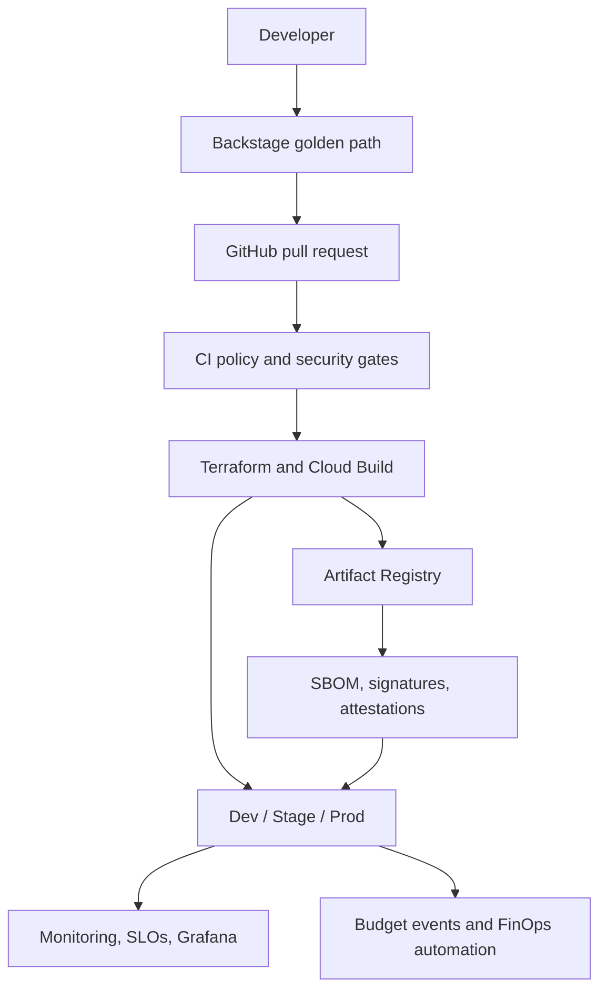

The platform separates source validation, artifact creation, trust verification, environment deployment, and operations. An artifact is built once, identified by digest, verified, and promoted without rebuilding it for each environment.

## Delivery and Promotion Model

1. A developer creates or changes a service through the golden path.
2. A pull request runs Terraform validation, policy checks, and security scanning.
3. GitHub Actions authenticates to Google Cloud through repository-scoped Workload Identity Federation.
4. Cloud Build produces the application image.
5. The release pipeline resolves the immutable digest, generates an SPDX SBOM, scans the image, signs it, and publishes attestations.
6. Deployment workflows verify the artifact's digest, signer identity, issuer, and provenance before deployment.
7. The same verified digest is promoted through development, stage, and production with environment protections and approvals.
8. Monitoring, SLOs, alerts, deployment evidence, and FinOps automation provide the operational control plane.

## Technology Stack

| Category | Technologies |
| --- | --- |
| Cloud | Google Cloud Platform |
| Infrastructure as Code | Terraform |
| Runtime and compute | Cloud Run, Google Kubernetes Engine, Managed Instance Groups |
| Build and registry | Cloud Build, Artifact Registry |
| CI/CD | GitHub Actions |
| Identity | GitHub OIDC, Workload Identity Federation, Google Cloud IAM |
| Policy and scanning | Open Policy Agent, Checkov, tfsec |
| Supply chain | Syft, Cosign, SPDX SBOM, attestations |
| Messaging and FinOps | Cloud Billing budgets, Pub/Sub, Cloud Run |
| Observability | Cloud Monitoring, Cloud Logging, Grafana Cloud, Prometheus metrics |
| Developer portal | Backstage, Software Templates, TechDocs |
| Next platform capability | Vertex AI |

## Repository Structure

The exact contents evolve as new golden paths are added. The principal areas are:

```text
paved-road-platform/
├── .github/workflows/          # Validation, build, release, promotion, and IAM workflows
├── backstage/                  # Catalog entities, templates, and portal configuration
├── docs/                       # Architecture, security, observability, FinOps, and runbooks
├── policy/                     # OPA policies and test examples
├── sbom/                       # Human-readable SBOM artifacts and supporting material
├── services/
│   └── finops-budget-consumer/ # Budget-event consumer and automated tests
├── terraform/
│   ├── environments/           # Development, stage, and production configurations
│   ├── modules/                # Cloud Run, GKE, and MIG modules
│   └── platform/               # Shared platform IAM and promotion controls
├── testing/
│   └── failure-injection/      # SLO and alert-validation workloads
└── README.md
```

## Quick Start

Clone the repository:

```bash
git clone https://github.com/Marcel2tight/paved-road-platform.git
cd paved-road-platform
```

Format and validate the Terraform configuration for the environment or platform component you intend to inspect:

```bash
terraform -chdir=<terraform-directory> fmt -check
terraform -chdir=<terraform-directory> init
terraform -chdir=<terraform-directory> validate
terraform -chdir=<terraform-directory> plan
```

Run the FinOps budget-consumer test suite:

```bash
python -m pytest -q services/finops-budget-consumer
```

Deployments and privileged IAM changes should be run through the corresponding GitHub Actions workflow so that OIDC authentication, approval gates, concurrency controls, and saved-plan verification remain in force.

## Implementation Journey

| Phase | Outcome | Status |
| --- | --- | --- |
| 1. Cloud foundation | GCP projects, remote state, IAM foundation, GitHub OIDC | ✅ Complete |
| 2. Reusable infrastructure | Terraform modules for Cloud Run, GKE, and MIG | ✅ Complete |
| 3. Developer self-service | Backstage catalog, templates, TechDocs, golden paths | ✅ Complete |
| 4. Multi-environment delivery | Development, stage, and production configurations and workflows | ✅ Complete |
| 5. DevSecOps guardrails | PR validation, OPA, Checkov, tfsec, labels, governance | ✅ Complete |
| 6. SRE and observability | Logging, dashboards, SLOs, burn alerts, failure injection, notifications | ✅ Complete |
| 7. Software supply chain | Immutable artifacts, SBOMs, scanning, signing, attestations, verified promotion | ✅ Complete |
| 8. FinOps automation | Budget events, Pub/Sub consumer, schema controls, secure consumer release | ✅ Complete |
| 9. Vertex AI golden path | Governed model development, deployment, monitoring, and cost controls | ⏭️ Next |

This sequence forms a clean platform completion path: establish the foundation, standardize delivery, add security and reliability controls, secure the artifact lifecycle, and then automate cost governance. Vertex AI builds on those controls instead of creating a separate delivery model.

## Current Status

The platform has reached its **FinOps automation milestone**. The core IDP path—from developer self-service through secure infrastructure delivery, immutable artifact promotion, observability, and automated budget-event processing—is implemented.

| Capability | Status |
| --- | --- |
| GCP and Terraform foundation | ✅ Complete |
| Development, stage, and production architecture | ✅ Complete |
| Cloud Run golden path | ✅ Complete |
| GKE and MIG reusable module foundations | ✅ Complete |
| Backstage portal, catalog, TechDocs, and templates | ✅ Complete |
| GitHub Actions, Cloud Build, and keyless OIDC | ✅ Complete |
| Policy as Code and security scanning | ✅ Complete |
| SLOs, alerts, logging, and Grafana dashboards | ✅ Complete |
| Immutable artifact promotion and supply-chain evidence | ✅ Complete |
| FinOps budget consumer and secure release pipeline | ✅ Complete |
| Vertex AI platform golden path | ⏭️ Next phase |

## Screenshots

The screenshots below provide visual evidence of completed platform capabilities across developer experience, CI/CD, cloud runtime, observability, reliability engineering, software supply-chain security, immutable promotion, and FinOps automation.

| Capability | Screenshot |
| --- | --- |
| Backstage Developer Portal | 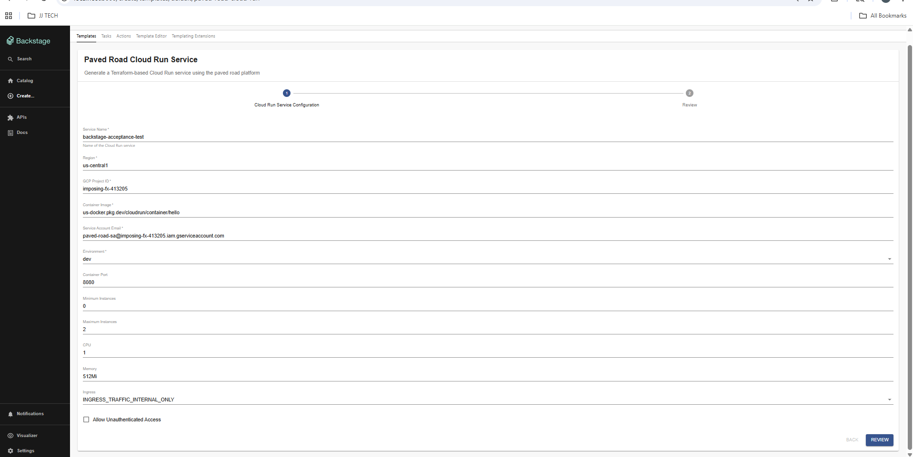 |
| Backstage Service Catalog | 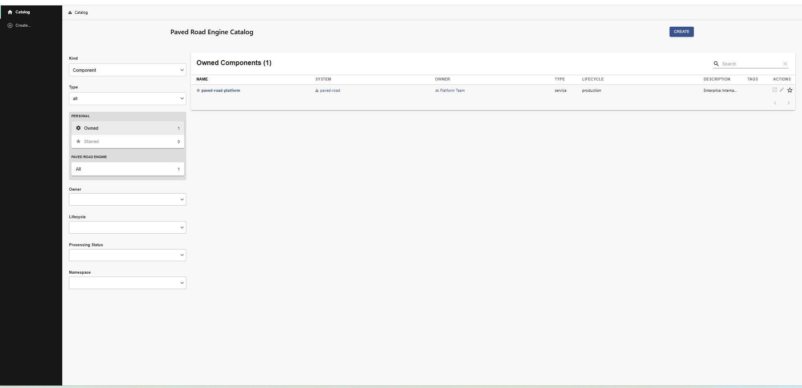 |
| GitHub Actions CI/CD | 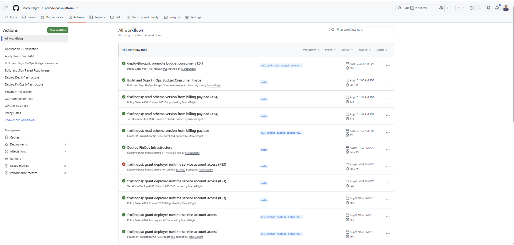 |
| Cloud Run Services | 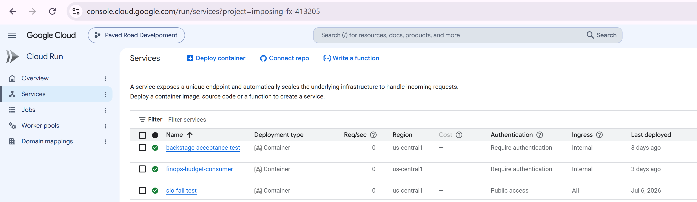 |
| Cloud Monitoring Dashboard | 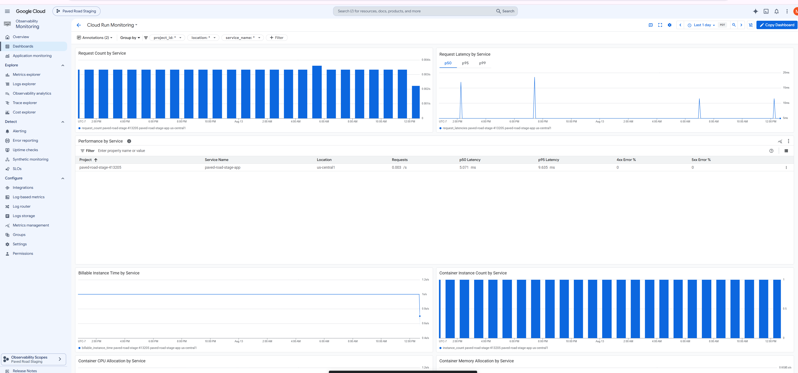 |
| Grafana Platform Overview | 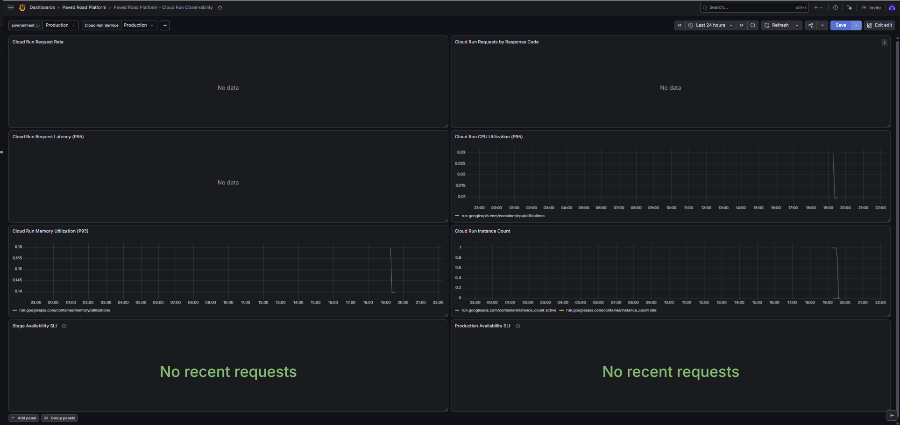 |
| SLO and Burn-Rate Alerts | 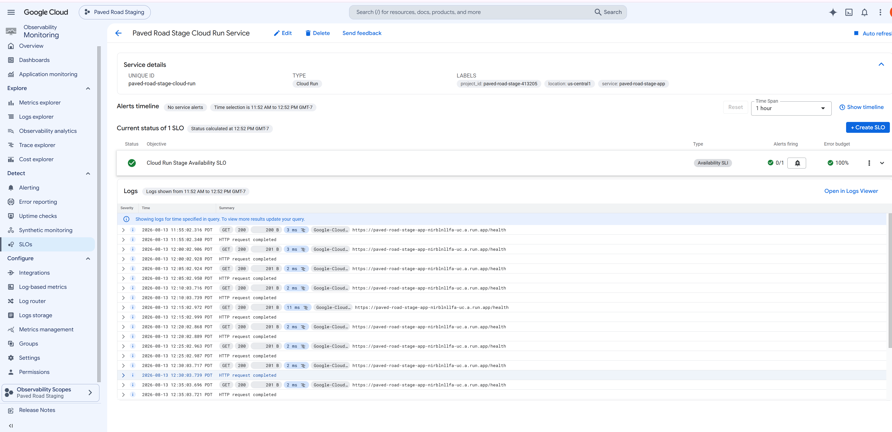 |
| Supply-Chain Security Workflow | 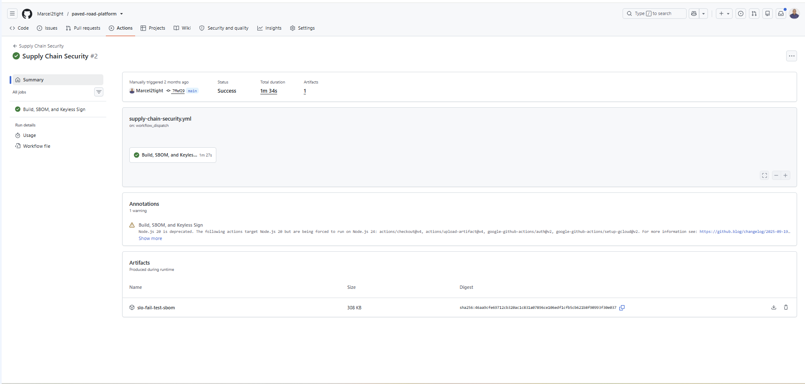 |
| SBOM, Signing, and Attestations | 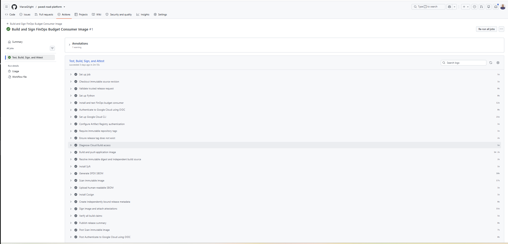 |
| Immutable Artifact Promotion | 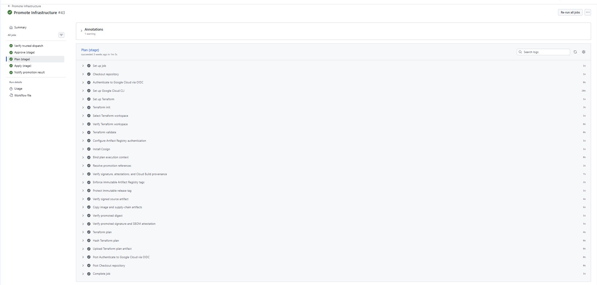 |
| FinOps Budget Consumer | 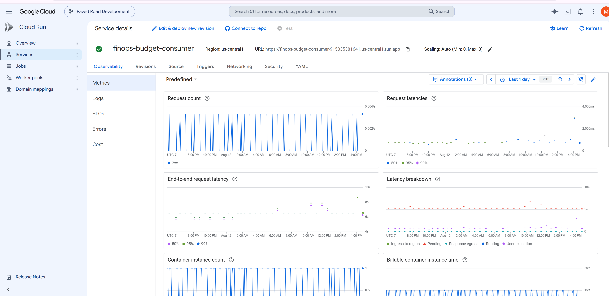 |
| FinOps Secure Release Workflow | 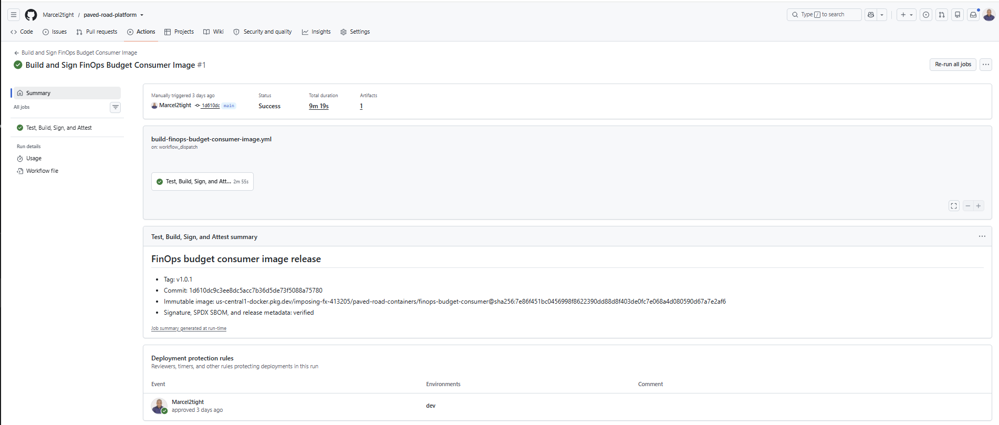 |
| Platform Architecture | 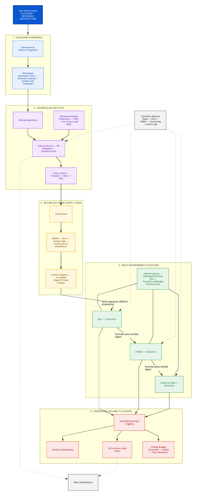 |

> Visual evidence is curated from completed implementation checkpoints and maintained alongside the platform documentation.

## Documentation

| Directory | Purpose |
| --- | --- |
| `docs/architecture/` | Platform architecture and design decisions |
| `docs/security/` | OIDC, IAM, policy, and supply-chain security |
| `docs/observability/` | Monitoring, logging, SLOs, Grafana, and metrics |
| `docs/backstage/` | Catalog, templates, and developer-portal guidance |
| `docs/golden-paths/` | Standard developer onboarding and delivery paths |
| `docs/runbooks/` | Deployment, incident, verification, and operational procedures |

## Enterprise Design Principles

- **Standardization:** reusable modules and templates reduce one-off infrastructure.
- **Self-service with guardrails:** developers move quickly without bypassing organizational controls.
- **Security by default:** identity, policy, scanning, signing, and verification are part of the delivery path.
- **Build once, promote many:** environments consume the same verified artifact digest.
- **Observability first:** services ship with monitoring, logging, SLOs, and actionable alerts.
- **Cost accountability:** labels and automated billing events connect engineering activity to financial governance.
- **Everything as code:** infrastructure, policies, workflows, documentation, and operational controls are versioned and reviewable.

## Next Phase: Vertex AI

Vertex AI is the next major extension of the paved road. The objective is to provide a secure, repeatable machine-learning delivery path that reuses the platform's existing identity, governance, supply-chain, observability, and FinOps controls.

The planned Vertex AI path includes:

- Terraform modules for Vertex AI resources and environment separation
- Governed dataset, training, model registry, endpoint, and deployment patterns
- GitHub OIDC-based ML pipelines without static keys
- Model and container provenance, approval, and promotion controls
- Online endpoint monitoring, logging, latency, availability, and drift signals
- Budget controls, labels, quotas, and per-model cost visibility
- A Backstage template for self-service AI service onboarding
- Runbooks for model deployment, rollback, incident response, and cost management

## Future Roadmap

After the Vertex AI foundation:

- Platform scorecards and broader golden-path coverage
- Managed Service for Prometheus and OpenTelemetry
- Distributed tracing and expanded service-level dashboards
- Full GKE platform deployment with GitOps and Helm
- Binary Authorization and additional organization-policy constraints
- Automated cost optimization and chargeback/showback reporting

## Interview Highlights

The project provides practical examples of:

- Internal Developer Platforms and developer self-service
- Terraform module design and multi-environment architecture
- GitHub Actions, Cloud Build, and keyless cloud authentication
- Policy as Code and shift-left security
- Immutable artifact promotion and software supply-chain security
- SLOs, error budgets, failure injection, and operational dashboards
- Event-driven FinOps automation
- The foundation for governed MLOps on Vertex AI

## Author

### Prince Owhonda

Senior Platform / DevOps Engineer specializing in Google Cloud Platform, platform engineering, DevSecOps, SRE, Kubernetes, Terraform, GitHub Actions, Zero Trust architecture, and Infrastructure as Code.

## License

This repository is provided for educational, portfolio, and demonstration purposes. It showcases enterprise platform-engineering concepts, cloud-native architecture, and Infrastructure as Code practices.

---

The Paved Road Platform now demonstrates an end-to-end path from developer intent to governed cloud operations and automated FinOps. The next evolution is to apply the same paved-road principles to Vertex AI and enterprise MLOps.
